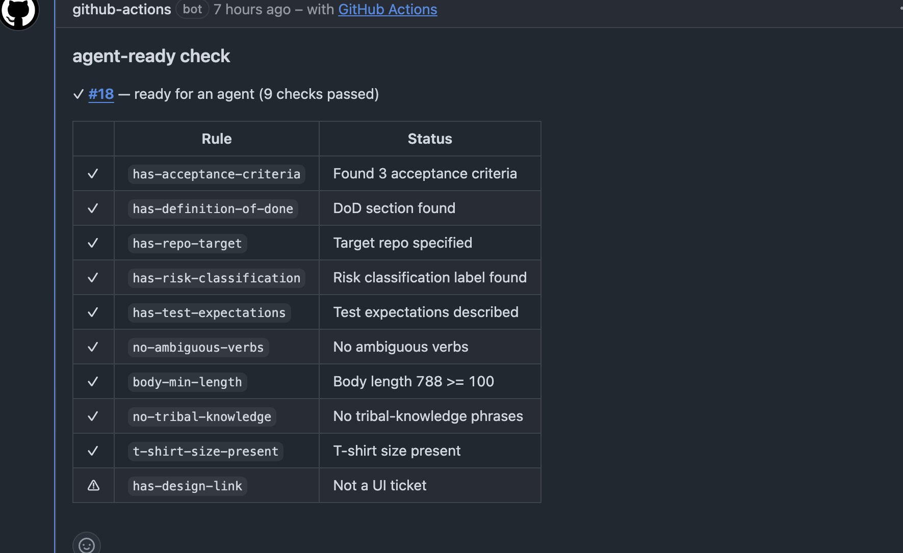

# agent-ready

> The Definition-of-Ready gate for AI coding agents.

[](https://github.com/agentlane/agent-ready/actions/workflows/ci.yml) [](https://www.npmjs.com/package/@agentlane/agent-ready) [](https://github.com/agentlane/agent-ready/releases) [](LICENSE)

Before Copilot, Cursor, Claude Code, Codex, or any custom agent picks up a ticket, `agent-ready` checks whether that ticket has enough context to produce a safe, correct PR.

**Bad ticket in → exact gaps out — in 50 ms, before any tokens are spent.**


```bash
$ npx @agentlane/agent-ready check examples/tickets/bad-ticket.json

✗ PROJ-1234  not ready  (4 blocker(s), 7 warning(s))
Signals: path C | context T2 | risk medium

  ✗ has-acceptance-criteria       No acceptance criteria found (need at least 1)
  ⚠ has-definition-of-done        No Definition of Done found
  ✗ has-repo-target               Ticket does not specify the target repo
  ✗ has-risk-classification       No risk classification label
  ⚠ has-test-expectations         No test expectations described
  ⚠ no-ambiguous-verbs            Ambiguous verb(s): improve, make it better
  ✗ body-min-length               Body too short: 91 chars (need >= 100)
  ⚠ no-tribal-knowledge           Tribal-knowledge phrase(s): you know what i mean
  ⚠ t-shirt-size-present          No t-shirt size estimate
  ⚠ has-design-link               UI ticket has no design link
  ⚠ restricted-paths-declared     Restricted-scope signals without risk:high: checkout
```

```bash
$ npx @agentlane/agent-ready check examples/tickets/good-ticket.json

✓ PROJ-2042  ready  (10 checks passed, 1 warning(s))
Signals: path B | context T2 | risk low
```

## Try it in 30 seconds

```bash
npx @agentlane/agent-ready check https://github.com/agentlane/agent-ready/issues/1 --adapter github
```

No install needed. Uses `gh auth token` or `GITHUB_TOKEN` automatically.

---

## Why agent-ready exists

Every team adopting AI coding agents hits the same wall:

> **Garbage tickets → garbage PRs.**

Agents are confident and fast. Without a clear ticket, that's a liability — they invent context, miss the real requirement, and silently burn tokens chasing the wrong thing.

`agent-ready` is the **front door** of the agentic SDLC: an automated readiness gate that runs in 50 ms, plugs into the workflows your team already uses, and produces machine-readable verdicts agents can act on.

### Before vs. after

| Without `agent-ready` | With `agent-ready` |
|---|---|
| Agent invents missing context | Ticket validated before agent picks it up |
| Vague verbs slip through ("improve", "clean up") | Ambiguous verbs flagged at issue-open time |
| No design link → agent guesses UI | UI tickets require a Figma/Miro link |
| Agent burns tokens on a half-baked ticket | CI fails fast (50 ms) before any tokens are spent |
| No repo target → wrong codebase modified | `repo:` field enforced as a blocker |
| Subjective PR review ("this doesn't match the ticket") | Objective AC checklist baked into the ticket |
| No data on what makes agents succeed | Feedback loop surfaces which rules predict success |

### How it's different

- **Pure linter, not another agent framework.** `agent-ready` doesn't try to write tickets, run agents, or review PRs. It does one thing: grade the readiness of a ticket. That's why it's 50 ms and 800 lines of TypeScript, not a platform.
- **Pluggable into every surface.** CLI, GitHub Action, MCP tool, Node SDK, and observability sinks — the same lint engine, exposed five ways. Pick the surface that fits your stack.
- **Deterministic signals.** Every check emits `path_recommendation` (A/B/C), `context_tier` (T1/T2/T3), and `risk_classification` (low/medium/high) — so downstream agents and policy engines route on objective fields, not free text.
- **Policy-as-code via OPA.** Built-in rules cover the common cases; Rego policies handle your org-specific governance.
- **Closes the loop.** Record agent outcomes against `run_id` and surface which rules actually predict success.

---

## Five ways to integrate

The same lint engine, exposed five ways. Pick the surface that fits your stack — they're not exclusive:

| Surface | Best for | Latency | Setup |
|---|---|---|---|
| **CLI** | Local dev, CI scripts | ~50 ms | `npx @agentlane/agent-ready` |
| **GitHub Action** | Auto-check on issue-open | ~3 s cold | Drop YAML in `.github/workflows` |
| **MCP server** | Claude Desktop, Cursor, custom agents | ~50 ms in-process | Add to MCP config |
| **Node SDK** | Custom orchestrators, embedded checks | direct call | `import { lintTicket }` |
| **Telemetry sinks** | Dashboards, trend analysis (Grafana, Langfuse, OTel) | fire-and-forget | Add `output.sinks` to rule pack |

All five share one rule pack, one schema, and one verdict.

---

## Who is this for?

- **Open-source maintainers** — gate AI-generated PRs before accepting them; require issues to meet your readiness bar first
- **Platform / DevEx teams** — enforce a pre-flight check before any coding agent starts work, company-wide
- **DevSecOps & governance teams** — auditable, automated evidence that restricted-scope tickets declared risk correctly; OPA policy bridge for policy-as-code
- **Product owners** — force better specs before engineering starts; catch "as discussed" and missing AC early
- **Teams using Copilot, Cursor, Claude Code, Codex, or any custom agent** — stop wasting tokens on half-baked tickets

---

## Install

```bash
# One-off use with a local ticket file
npx @agentlane/agent-ready check <path-to-ticket-json>

# Or fetch a real GitHub Issue
npx @agentlane/agent-ready check owner/repo#123 --adapter github

# Or install globally
npm i -g @agentlane/agent-ready
agent-ready check ./ticket.json

# Or install as a library for programmatic use
npm install @agentlane/agent-ready
```

> Supports local JSON tickets, GitHub Issues, Jira Cloud, and Linear out of the box.

---

## CLI

```bash
# Lint a ticket
agent-ready check examples/tickets/bad-ticket.json
agent-ready check agentlane/agent-ready#1 --adapter github
agent-ready check PROJ-123 --adapter jira
agent-ready check TEAM-123 --adapter linear

# Use a custom rule pack
agent-ready check ./ticket.json --rules ./my-rules.yaml

# Output formats
agent-ready check ./ticket.json --format text       # default (human)
agent-ready check ./ticket.json --format markdown   # PR comment
agent-ready check ./ticket.json --format json       # machine-readable
agent-ready check ./ticket.json --format sarif      # GitHub code-scanning

# Skip telemetry sinks for this run
agent-ready check ./ticket.json --no-telemetry

# Record agent outcomes for the feedback loop
agent-ready feedback record --ticket-id PROJ-123 --outcome success --run-id <uuid> --duration-min 22

# Report on recorded outcomes
agent-ready feedback report --runs .agent-ready/runs.jsonl
```

**Exit codes:** `0` ready · `1` not ready · `2` usage error.

### Auth

| Adapter | Required env vars |
|---|---|
| **GitHub** | `GITHUB_TOKEN` / `GH_TOKEN` (or `gh auth token` automatically) |
| **Jira Cloud** | `JIRA_BASE_URL`, `JIRA_EMAIL`, `JIRA_API_TOKEN` |
| **Linear** | `LINEAR_API_KEY` |

```bash
# Jira
export JIRA_BASE_URL=https://acme.atlassian.net
export JIRA_EMAIL=you@example.com
export JIRA_API_TOKEN=...   # https://id.atlassian.com/manage-profile/security/api-tokens
agent-ready check PROJ-123 --adapter jira

# Linear
export LINEAR_API_KEY=lin_api_...   # https://linear.app/settings/api
agent-ready check TEAM-123 --adapter linear
```

---

## Node SDK

Call `lintTicket` directly — no CLI shell-out:

```ts
import { lintTicket, loadTicketFromFile, renderText } from "@agentlane/agent-ready";
import { readFile } from "node:fs/promises";
import { parse as parseYaml } from "yaml";

const pack = parseYaml(
  await readFile("node_modules/@agentlane/agent-ready/rule-packs/default.yaml", "utf8")
);

const ticket = await loadTicketFromFile("./ticket.json");
const result = await lintTicket(ticket, pack, { adapter: "file", rulePackName: "default" });

console.log(result.ready);      // true | false
console.log(result.signals);    // { path_recommendation, context_tier, risk_classification }
console.log(result.run_id);     // UUIDv4 — join key for feedback events
console.log(renderText(result));
```

Sub-path imports: `@agentlane/agent-ready/adapters`, `@agentlane/agent-ready/render`, `@agentlane/agent-ready/types`.

Full API reference: [docs/sdk.md](docs/sdk.md).

---

## MCP server

`agent-ready` ships an MCP (Model Context Protocol) server. Wire it into Claude Desktop or Cursor once, then any agent can call the `agent_ready_check` tool inline as part of its reasoning loop.

```json
{
  "mcpServers": {
    "agent-ready": {
      "command": "npx",
      "args": ["-y", "--package=@agentlane/agent-ready", "agent-ready-mcp"],
      "env": { "GITHUB_TOKEN": "ghp_..." }
    }
  }
}
```

The tool accepts `target`, `adapter`, `rules`, and `format`, and returns the full `LintOutput` JSON. Agents can now reason about `ready`, `signals`, and per-rule `checks` without an external shell-out.

> **Use case:** "Claude, before you implement issue #42, check it with agent-ready." The agent calls the tool, reads the gaps, and asks you to add acceptance criteria before writing any code.

Full setup (Claude Desktop, Cursor, custom Node clients): [docs/mcp.md](docs/mcp.md).

---

## GitHub Action

Available on the [GitHub Marketplace](https://github.com/marketplace/actions/agent-ready-check). Drop into `.github/workflows/agent-ready.yml`:

```yaml
name: Agent-Ready Check
on:
  issues:
    types: [opened, edited, labeled]

jobs:
  check:
    runs-on: ubuntu-latest
    permissions:
      contents: read
      issues: write
    steps:
      - uses: actions/checkout@v4
      - uses: agentlane/agent-ready@v0
        with:
          github-token: ${{ secrets.GITHUB_TOKEN }}
          rules: .agent-ready/rules.yaml   # optional
          comment-on-issue: true
          fail-on-not-ready: true
          set-label: true                  # adds/removes the `agent-ready` label
```

The action fetches the triggering issue, lints it, posts a Markdown comment, and (when `set-label: true`) toggles the `agent-ready` label on each pass/fail. Step outputs: `ready`, `failed-count`, `warnings-count`.

**Passing-issue comment:**



### Trigger a coding agent only when ready

Because the action toggles a label, a second workflow can dispatch your agent **exactly once per passing issue** — not on every edit:

```yaml
# .github/workflows/start-agent.yml
on:
  issues:
    types: [labeled]
jobs:
  dispatch:
    if: github.event.label.name == 'agent-ready'
    runs-on: ubuntu-latest
    steps:
      - run: echo "Issue ${{ github.event.issue.number }} is ready — dispatch agent here"
        # Replace with: gh workflow run, invoke Copilot, call Claude Code CLI, etc.
```

Full walkthrough examples: [docs/use-cases.md](docs/use-cases.md).

---

## What it checks

### 12 built-in rules

| Rule | What it looks for |
|---|---|
| `has-acceptance-criteria` | At least N acceptance criteria (numbered list, checklist, or Given/When) |
| `has-definition-of-done` | A DoD section in the body |
| `has-repo-target` | `repo:` in the body or a `repo:<name>` label |
| `has-risk-classification` | A `risk:low`/`risk:medium`/`risk:high` label |
| `has-design-link` | Figma/Ardoq/Miro/Excalidraw link present when the ticket has a `ui`/`ux`/`frontend` label |
| `has-test-expectations` | "How to verify" / test plan / Playwright / Jest / Pytest mentioned |
| `no-ambiguous-verbs` | Flags vague verbs (`improve`, `optimize`, `clean up`, `refactor`, `enhance`, …) |
| `body-min-length` | Body is at least 100 characters (configurable) |
| `no-tribal-knowledge` | Flags phrases like "as discussed", "you know what I mean", "the usual way" |
| `t-shirt-size-present` | `size:` in the body or a `size:S\|M\|L\|XL` label |
| `restricted-paths-declared` | Auth/payment/identity/IAM/infra signals without a `risk:high` label |
| `llm-judge-ambiguity` | LLM clarity score with one-sentence explanation — **opt-in** (`enabled: false`) |
| `links-resolve` | URLs in the body return HTTP 200 — **opt-in** (offline-CI-friendly default) |

### Three rule extension points

1. **Built-in overrides** — tune severity, thresholds, and keywords per rule
2. **Custom regex rules** — `type: regex` for project-specific patterns (e.g. "must link to an epic")
3. **OPA policies** — `type: opa` for full Rego policy-as-code, evaluated against ticket + signals

### Why not just use issue templates?

Issue templates **guide humans**. `agent-ready` **enforces readiness automatically**. Use both: templates for authoring, `agent-ready` for the gate.

---

## Rule pack format

Rule packs are plain YAML. One file can mix all three rule types and configure telemetry sinks:

```yaml
# .agent-ready/rules.yaml
version: 1
extends: default

rules:
  # Built-in overrides
  has-acceptance-criteria:
    enabled: true
    min_count: 2
    severity: error

  no-ambiguous-verbs:
    severity: warn
    extra_terms: [tidy, polish, modernize]

  # Optional LLM judge
  llm-judge-ambiguity:
    enabled: true
    provider: openai
    model: gpt-4o-mini
    threshold: 0.6
    api_key_env: OPENAI_API_KEY

  # Custom regex rule
  must-link-epic:
    type: regex
    pattern: 'EPIC-\d+'
    field: body
    severity: error
    message: "Ticket must link to a parent epic (EPIC-XXX)"

  # OPA policy rule
  enforce-pii-risk:
    type: opa
    mode: remote
    server: http://localhost:8181
    query: data.pii.decision
    severity: error

# Deterministic routing thresholds
signals:
  risk_classification:
    default: medium
    label_prefix: "risk:"
  path_recommendation:
    default: A
    warning_threshold: 2
    ui_value: B
    warning_value: B
    fail_value: C
    high_risk_value: C
  context_tier:
    default: T1
    body_length_t2: 800
    body_length_t3: 2000

# Optional: emit results to dashboards / OTel / a file
output:
  sinks:
    - type: webhook
      url: https://collector.example.com/agent-ready
      headers: { Authorization: "Bearer ${WEBHOOK_TOKEN}" }
    - type: jsonl
      path: .agent-ready/runs.jsonl
    - type: otel
      endpoint: http://localhost:4318/v1/traces
```

JSON Schemas live in [`schema/`](schema/) — rule pack ([`rule-pack.schema.json`](schema/rule-pack.schema.json)) and output ([`output.schema.json`](schema/output.schema.json)). The output schema is stable across versions; downstream tools can safely consume it.

---

## Signals: deterministic routing for downstream agents

Every lint produces three signals derived from the rule results and labels — designed to drive deterministic routing in agent orchestrators:

| Signal | Values | Meaning |
|---|---|---|
| `path_recommendation` | `A` / `B` / `C` | A = autonomous, B = supervised, C = humans only |
| `context_tier` | `T1` / `T2` / `T3` | How much context the agent needs (RAG depth, token budget) |
| `risk_classification` | `low` / `medium` / `high` | Derived from `risk:*` label or default |

A downstream agent runner reads `signals.path_recommendation` and dispatches to the appropriate model + policy. Thresholds are fully configurable per rule pack.

---

## Policy-as-code (OPA)

Delegate decisions to [Open Policy Agent](https://www.openpolicyagent.org/) policies written in Rego. Two modes: REST server (`mode: remote`) or `opa eval` CLI (`mode: embedded`).

```yaml
rules:
  enforce-pii-risk:
    type: opa
    mode: remote
    server: http://localhost:8181
    query: data.pii.decision
    severity: error
```

OPA rules run **after** built-in rules and receive derived `signals` as input — so policies can enforce conditional risk routing based on the full lint context.

Three ready-to-use example policies in [`examples/policies/`](examples/policies/):
- `pii.rego` — restrict PII tickets to `risk:high`
- `payment.rego` — require `risk:high` + `size:L|XL` for payment work
- `infra.rego` — require `risk:high` and a rollback plan for infra changes

Full reference: [docs/opa.md](docs/opa.md).

---

## Telemetry

Emit each `LintOutput` to one or more observability sinks (webhook, JSONL, OTel) — for dashboards, trend analysis, and joining to downstream agent outcomes. All sinks are fail-soft.

```yaml
output:
  sinks:
    - type: webhook
      url: https://collector.example.com/agent-ready
      headers: { Authorization: "Bearer ${WEBHOOK_TOKEN}" }
    - type: jsonl
      path: .agent-ready/runs.jsonl
    - type: otel
      endpoint: http://localhost:4318/v1/traces
```

- `webhook` — POST JSON with env-var interpolation, 5 s timeout, no retry
- `jsonl` — append one line per run; parent dirs created automatically
- `otel` — single OTLP/HTTP span with signals as attributes and `CheckResult`s as events

Pass `--no-telemetry` to skip sinks for a single run.

Full reference: [docs/telemetry.md](docs/telemetry.md).

---

## Feedback loop

Every `LintOutput` carries a `run_id` (UUIDv4). Record agent outcomes against it, then surface which rules actually predict success:

```bash
# 1. Lint and capture the run_id
RUN_ID=$(agent-ready check PROJ-123 --adapter github --format json | jq -r '.run_id')

# 2. ... agent runs ...

# 3. Record the outcome
agent-ready feedback record \
  --ticket-id PROJ-123 \
  --run-id "$RUN_ID" \
  --outcome success \
  --duration-min 22

# 4. Per-outcome counts + per-rule predictive value table
agent-ready feedback report --runs .agent-ready/runs.jsonl
```

```
Total recorded runs: 42
  ✓ success    28  (67%)
  ~ partial     9  (21%)
  ✗ failure     5  (12%)

Per-rule predictive value:
  Rule                        Pass→Success  Fail→Success  Signal
  ───────────────────────────────────────────────────────────────
  has-acceptance-criteria     91%           23%           strong ↑
  has-test-expectations       88%           31%           strong ↑
  body-min-length             79%           44%           moderate
  t-shirt-size-present        62%           71%           inverse ↓
```

High-signal rules are reliable early-warnings — strong candidates for raising severity. Low-signal rules are candidates for tuning down. Full reference: [docs/feedback.md](docs/feedback.md).

---

## How it composes with the rest of your stack

`agent-ready` is the **first** gate. It doesn't replace your existing tools — it makes them work better:

| Tool | What it does | When it runs |
|---|---|---|
| **`agent-ready`** | Is this *ticket* ready for an agent? | Issue open → before agent picks up |
| Spec Kit / Linear specs | Authoring help for the spec itself | While writing the ticket |
| Your AI coding agent | Implements the change | After `agent-ready` passes |
| Gatepack *(planned)* | Per-PR signed evidence bundle (includes `agent-ready` pre-flight) | After agent submits PR |
| Evidence Gate Action | Traditional CI evidence (SBOM, SAST, tests) | During CI |
| OPA / your policy engine | Decision enforcement | Throughout |

### Gatepack pre-flight shape

Gatepack can store the JSON output under `pre_flight.agent_ready`. Fields intended for deterministic joining:

```json
{
  "pre_flight": {
    "agent_ready": {
      "schema_version": "1.2",
      "run_id": "f47ac10b-58cc-4372-a567-0e02b2c3d479",
      "ticket_id": "#123",
      "source": { "adapter": "github", "url": "https://github.com/agentlane/agent-ready/issues/123" },
      "rule_pack": "default",
      "rule_pack_version": "1",
      "rule_pack_hash": "sha256...",
      "signals": {
        "path_recommendation": "B",
        "context_tier": "T2",
        "risk_classification": "medium"
      },
      "ready": true,
      "summary": { "passed": 12, "failed": 0, "warnings": 1 }
    }
  }
}
```

---

## Status

**Current development: 0.2.0** — pluggable Agentic SDLC component.

Shipped in 0.2.0:
- **SDK surface** — barrel export and `exports` map (`@agentlane/agent-ready`, `/adapters`, `/render`, `/types`)
- **MCP server** — `agent_ready_check` tool for Claude Desktop, Cursor, and custom agents
- **Telemetry** — webhook, JSONL, and OTel sinks with env-var interpolation
- **OPA bridge** — `type: opa` rules in remote or embedded mode, three example policies
- **Feedback loop** — `run_id` on `LintOutput`, `feedback record/report` CLI, predictive value report
- **Native Jira & Linear adapters** — full CLI parity with GitHub adapter

Carried from 0.0.x: 12 built-in rules, regex custom rules, JSON/markdown/text/SARIF renderers, GitHub Action with label setter (Docker-based), CI on every PR. 204 passing tests, all verified end-to-end.

### Pinning

GitHub Action users should pin either:

```yaml
- uses: agentlane/agent-ready@v0.2.0  # exact release
- uses: agentlane/agent-ready@v0      # floating major tag — always latest stable
```

### Roadmap

Track planned work in [GitHub Issues](https://github.com/agentlane/agent-ready/issues). Near-term highlights:

- Expand Jira and Linear adapter coverage (ADF rendering, custom fields, sprints)
- LLM judge for `no-ambiguous-verbs` — opt-in ([#17](https://github.com/agentlane/agent-ready/issues/17))
- VS Code extension: lint as you type
- Node plugin loader for custom rules (beyond regex)

---

## Contributing

Rules are the easiest contribution path — one rule = one entry in `src/rules/built-in.ts` + one fixture in `examples/tickets/`.

**Good first contributions (no deep codebase knowledge needed):**
- Add a new readiness rule
- Add a bad/good ticket example pair
- Write a use-case walkthrough in `docs/`
- Improve Jira or Linear adapter coverage (e.g. ADF rendering, custom fields, sprints)
- Add an enterprise rule-pack example
- Author an OPA policy for `examples/policies/`

Browse [good first issues](https://github.com/agentlane/agent-ready/issues?q=is%3Aopen+label%3A%22good+first+issue%22) · [open an issue](https://github.com/agentlane/agent-ready/issues/new/choose) · PRs welcome.

## License

MIT.
